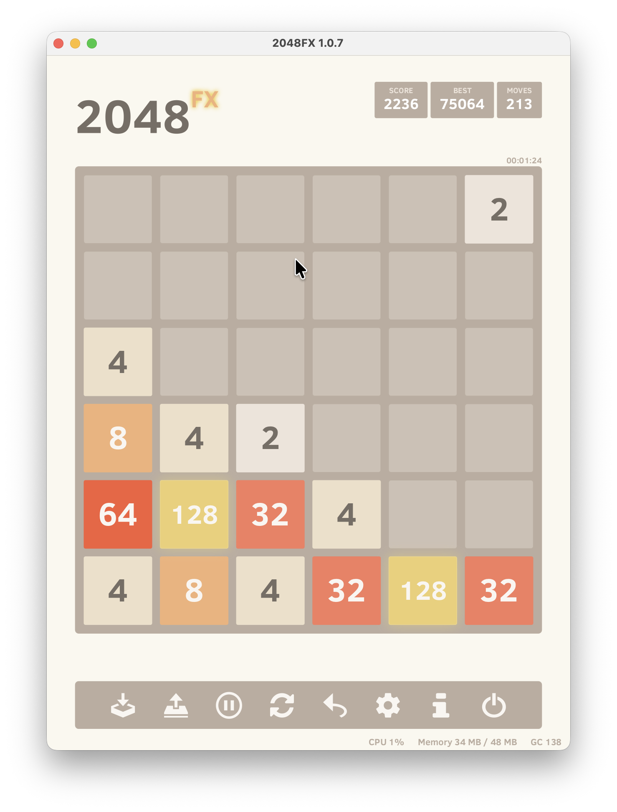

# 2048FX

The game 2048 built using JavaFX 16 and Java 17. This is a Java port based on the
Javascript version: https://github.com/gabrielecirulli/2048.

Check down below for a screenshot.

## Releases

[](https://github.com/brunoborges/fx2048/actions/workflows/gradle.yml)

You may find binaries available for download, for Windows, Mac and Linux, with Java bundled in. Check successful builds for stable releases.

## Screenshot



## Building and running

You will need [OpenJDK 17](http://jdk.java.net/) (or newer) installed to build and run the project:

```bash
./gradlew run
```

### Create a distribution to your operating system (Windows, Linux, or Mac OS)

You can create a ZIP file that will bundle a small JRE and the game, or you can create a native OS installer (e.g. MSI, DMG, DEB).

To create a ZIP bundle, run:

```bash
./gradlew dist
```

To create a native OS installer, run:

1. Run `./gradlew dist jpackage`

## Running using Docker
You can build container image from source code using the Dockerfile and run the containerized game. 
You have to share the X11 socket with the container. For that you need to install [VcXsrv Windows X Server](https://sourceforge.net/projects/vcxsrv/) for windows or [Xquartz](https://www.xquartz.org) if you're using macOS. Make sure to allow connections from network during setup.
On macOS, you'll need to run `xhost +127.0.0.1` every time you re-open Xquartz.
The final step is to run the container: `docker run -it --rm -e DISPLAY=host.docker.internal:0.0 image_name`

## Feedback / Contributing / Comments
Submit an issue and share your thoughts.

### Running with Java 8

If you want to run with Java 8, you can download the tag [java-8](https://github.com/brunoborges/fx2048/releases/tag/java-8). New features in the master branch will not be back-ported.

## License

The project is licensed under GPL 3. See [LICENSE](https://raw.githubusercontent.com/brunoborges/fx2048/master/LICENSE) file for the full license.
