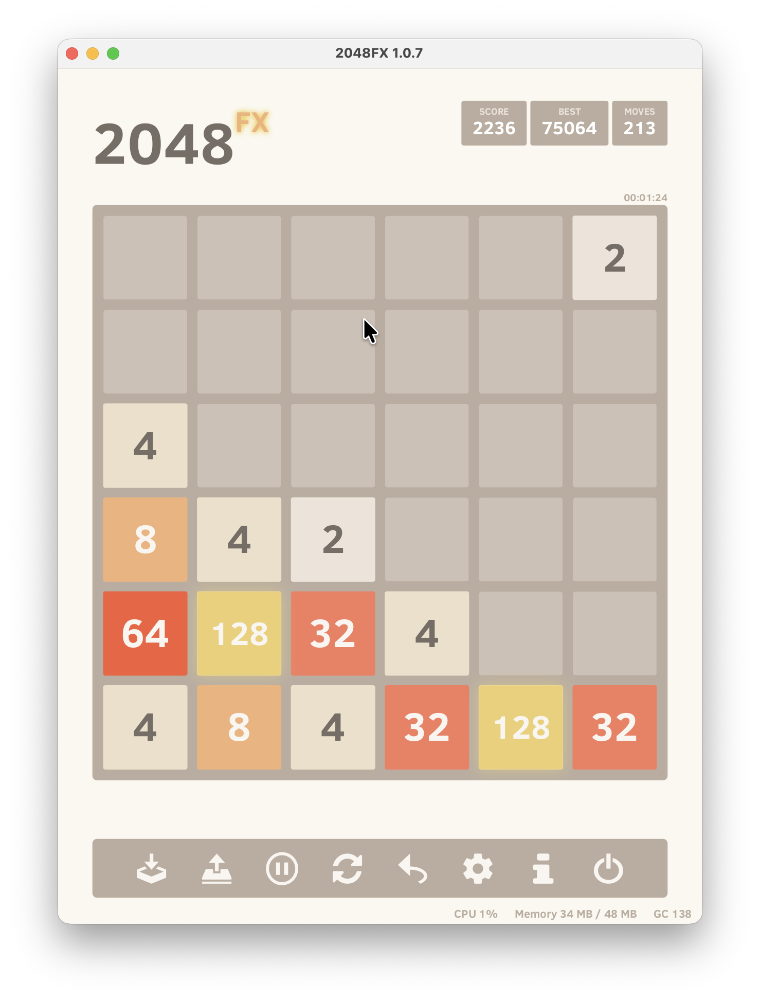

# 2048FX

The game 2048 built using JavaFX 25 and Java 25. This is a Java port based on the
JavaScript version: https://github.com/gabrielecirulli/2048.

Check down below for a screenshot.

## Releases

[](https://github.com/brunoborges/fx2048/actions/workflows/maven.yml)

Download ready-to-run packages for Windows, macOS, and Linux from [GitHub Releases](https://github.com/brunoborges/fx2048/releases). The release workflow builds macOS arm64 DMG, Windows x64 MSI, and Linux amd64/arm64 DEB packages, each with the Java runtime needed to run the game.

## Screenshot



## Building and running

You will need [OpenJDK 25](https://jdk.java.net/) installed to build and run the project.
Maven is the build system used by CI; use the included Maven wrapper:

```bash
./mvnw javafx:run
```

### Create a distribution to your operating system (Windows, Linux, or Mac OS)

You can create a ZIP file that bundles a custom runtime and the game, or create a native OS package. On macOS, the package is a DMG that opens in Finder for drag-and-drop installation.

To create a ZIP bundle, run:

```bash
./mvnw javafx:jlink
```

To create a native OS package, run:

```bash
./mvnw clean package javafx:jlink jpackage:jpackage
```

### Create a GitHub release

Run the [Release workflow](https://github.com/brunoborges/fx2048/actions/workflows/release.yml) manually from `main` to publish a new version. If `pom.xml` is at `1.0.2-SNAPSHOT`, the workflow prepares and tags `v1.0.2`, publishes the platform packages, and bumps `main` to `1.0.3-SNAPSHOT`.

Direct `v*` tag pushes are also supported when the tag points at a commit whose Maven project version exactly matches the tag without the leading `v`. The same version is shown in the application title/About dialog.

## Feedback / Contributing / Comments
Submit an issue and share your thoughts.

### Running with Java 8

If you want to run with Java 8, you can download the tag [java-8](https://github.com/brunoborges/fx2048/releases/tag/java-8). New features in the master branch will not be back-ported.

## License

The project is licensed under GPL 3. See [LICENSE](https://raw.githubusercontent.com/brunoborges/fx2048/main/LICENSE) file for the full license.
